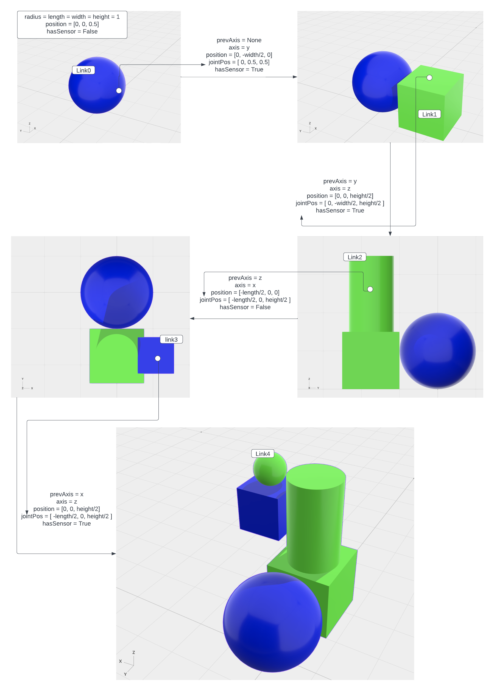

# cs-396-Alife - Omar Khatib

## Overall Architecture

The system here represents an evolutionary algorithm. It is comprised of multiple classes for a simulated world, a solution which creates a robot with body parts, joints, motors and sensors, a simulation class which runs the simulation, and a parallelHillClimber class that "evolves" the robot generated by the solution by assessing it during a run of the simulation against some fitness function with the goal of optimizing some behaviour.

This work employs 2 main libraries, the physics engines [PyBullet](https://pybullet.org/wordpress/), and the Python Robot Simulator [Pyrosim](https://github.com/jbongard/pyrosim), and builds on the turorial to build the framwework described in the Ludobots subreddit starting [here](https://www.reddit.com/r/ludobots/wiki/installation/)

## Running the Code:
### Follow the steps below to reproduce results

1. Clone the repository into a directory of your choice

2. create a virtual environment for the directory 

3. switch to the branch `assgmtX` by running `git checkout assgmtX` in your console

4. run `main.py`

## Assignment 5 - Design Your Own Creature

My program is designed to make a creature with 4 legs and 4 arms learn how to jump. To achieve the act of "jumping" in this evolutionary algorithm, a fitness function (`Get_Fitness()` in robot.py) records the fitness as a weighted sum of the longest time the 4 legs are off the ground denoted by `maxLen`, and the z coordinate of the torso denoted by `zposition`. 
The fitness is then maximized through multiple parallel simulations over a number of generations to find the best performing creature. 

## Assignment 6 - generate random 1D creature morphologies

I edited the solution.py to generate random geometries of a 1D kinematic machine with random number of randomly shaped links with random sensor placement along the chain. Links with and without sensors are colored green and blue, respectively. The different shapes (box, sphere, and cylinder) are added by altering multiple files in the pyrosim directory to be written into the body.urdf file correctly

## Assignment 7 - expand the design space of your random creature generator to 3D

For this assignment I edited `solution.py` to generate a random body in 3D space. Generate_Body() calls a Generate_Link() method to generate the next link based on random choices of shape, length, width height, axis, and a boolean deciding whether the link will have a sensor neuron or not. If hasSensor = True the link is added to a list of links with sensors `linksWithSensors`. Next, a Generate_Joints() methods is called to generate the next joint based on the previous axis chosen and the new axis chosen as each combination results in different relative positions.  

The Generate_Brain() method adds motor neurons to all the joints and sensor neurons to the links in the `linksWithSensors` list. A synapse is sent between every motor neuron and sensor neuron.

The process described above is shown in the diagram below. 

