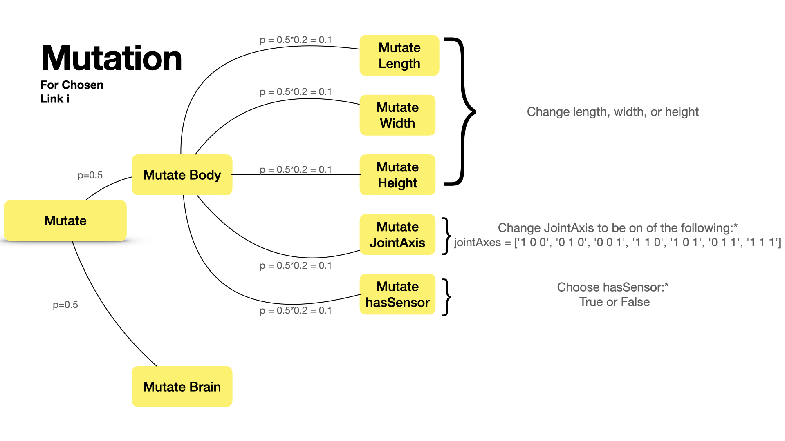

# Artificial Life Project
# Overview

Evolution is a process that has been observed in nature for billions of years. It is a process by which a population of organisms changes over time. The changes are due to the interaction of the organisms with their environment, and the organisms with each other. The changes are passed on to the next generation of organisms. The changes are random, and the organisms that are better adapted to their environment are more likely to survive and reproduce. This process is called natural selection. The goal of this project is to implement a system that mimics this process in a simulated environment. The system will be able to generate a population of creatures, simulate them in a virtual world, and evolve the creatures to be better adapted to their environment. The creatures will be simulated in a virtual world, and the fitness of each creature will be calculated based on how well it performs in the world. The creatures will be evolved by mutating their morphology and behaviour, and the creatures with the best fitness will be selected to reproduce. The process will be repeated over multiple generations to allow the creatures to evolve to be better adapted to their environment. A snippet of my work is shown below, and the link below is to the full video showcasing my results.

## GIF

## Video
watch full video [here](https://youtu.be/gLQ0GxidfXY)

# Overall Architecture

The system here represents an evolutionary algorithm. It is comprised of multiple classes spanning a simulated world a solution which invokes a Link class to create a robot with body parts, joints, motors and sensors, a simulation class which runs the simulation, and a parallelHillClimber (PHC) class that "evolves" the robot generated by the solution by assessing it during a run of the simulation against some fitness function with the goal of optimizing some behaviour. In this case, the behaviour is to minimize the x position of the robot.

# Methodology
## Random Morphology Generator
The random morphology generator is a class called `solution.py` which generates a random robot with a random body and brain.
### Body
 The body is generated in the `Generate_Body()` method, which creates instances of a `link` class and stores them in a dictionary `self.links`. The `link` class contains a `Generate_link()` method which is used to generate the next link and a `Generate_Joint()` method that generates a joint of the next link. These methods function based on random choices of number of links, shape, length, width height, axis, joint axis, and a boolean deciding whether the link will have a sensor neuron or not. 

Below is a diagram showing the process of generating a random body link by link, and how it is stored in the `links` dictionary:

 

### Brain
The brain is generated in the `Generate_Brain()` method. The method adds motor neurons to all the joints and sensor neurons to the links in the `linksWithSensors` list. A synapse is sent between every motor neuron and sensor neuron to form a fully connected brain.

## Mutation
The mutation process is done in the `mutate()` method in the `solution.py` class. The method mutates the body and brain of the robot by choosing a link out of all the links in the body. The mutation process for a randomly chosen link is outlined in the diagram below:

* Randomly changing joint axis of a link to one of the options shown in the diagram above with uniform probability. Joint axis is of the form (x,y,z) where x,y,z are either 0 or 1, and 1 is freedom in that axis
* Changing hasSensor is done by updating the hasSensor attrivute of the link by randomly choosing a boolean value with uniform probability (0.5), and then updating the `linksWithSensors` list accordingly, as well as the weights matrix by adding or removing a row and column of random weights
* Modifying the body ends with a call to a `modifyBody()` method which regenerates the links and joints with the mutates values. 

## Selection
### Fitness Function
The fitness function is an objective measures as the x coordinate of the robot at the end of the simulation. The fitness function is defined in the `Get_Fitness()` method in robot.py. In this case, the fitness function is the x coordinate of the robot, and the objective is to minimize this coordinate.

### Parallel Hill Climber
The parallel hill climber (phc) is a class called `parallelHillClimber.py` which is used to evolve the robot generated by the solution by assessing it during a run of the simulation against some fitness function with the goal of optimizing some behaviour. I run phc 10 times with different seeds, resulting in different morphologies. Each run is then left to evolve for 500 generations over a popoulation size of 10. At the end, the best one (best fitness) is chosen and its brain and body saved in the `save` folder. The diagram below shows the process of evolving a robot using the parallel hill climber:

# Results

## Time
After much experimentation, and recording the runTime information in `save/runTime.txt`, I found that a using a population size of 10 and 500 generations, each parallel hill climber run took an average of 16 minutes and 30 seconds to run. In total, the 10 runs took an average of 2.6 hours (~2hrs 40mins)  to run on my macbook of 1.4 GHz Quad-Core Intel Core i5 processor with 16 GB of RAM.

## Fitness
For each PHC run, I saved the fitness values of each generation for the whole population in `save/fitnessMat{runNumber}.txt`. In addition, I also save the best fitness value of each generation in `save/minfitnessList{runNumber}.csv`. The best fitness values over 500 generations of 10 runs on different seeds are shown in the graph below:

## Morphologies
There is a lot of diversity in the morphologies found, as some exhibit complex motion, and some are very simple. It is observed that most of the saved robots have a tiny vibration motion that allows them to move in the -x direction, but they appear as if they are gliding across the floor almost. The number of links I noticed increases the complexity of the motion, but it could also lead to the robot moving slower and in worse diretions. The motor force is set to 50 to allow for realistic motion, and the motor joint range is set to 0.7 to limit the body movements to a smaller subset to find better solutions. The motor joint range could be increased to allow for more complex motion, but this would also increase the search space and thus the time needed to find a good solution.

## Limitations

There are some issues with the evolution as the evolved creatures do not perform as well as needed. A solution could be to expand the body mutations possible to include adding/deleting links. I attempted this in addition to making the body expand from any link randomly but I did not have enough time to get it working perfectly. In addition, another solution could be to add more sensors to the body to allow for more complex behaviours. Also, a larger population size could be used to allow for more diversity in the population and thus more likely to find a good solution and more generations could be run to allow for more time for the population to evolve. 

# Installation and Running
## Clone Repository and Set up the environment

1. Clone the repository into a directory of your choice

2. create a virtual environment for the directory 

3. switch to the branch `final` by running `git checkout final` in your console

4. run `pip install -r requirements.txt` to install the required libraries

## Running the code

Running the code is done by running the `search.py` file. Using the command line, it is possible to run the program according to script below:

    python3 search.py -type=<type> -run=<number of PHC runs> -seed=<seed value to use>

where the `type` flag is either `evolve` or `show`. `evolve` runs the parallel hill climber to evolve the robots. `show` is used to view the saved runs of the robot after it has been evolved in the `save` folder.

The `run` flag is the number of runs of the parallel hill climber to run. The default is 10.

The `seed` flag is the seed value to use for reproducing the same results. The default is None which uses a the current time as the seed value for that PHC run. The seed value for each run is saved in `save/seeds.csv`. 

## examples:
    
    python3 search.py -type=evolve -run=10

This will run the parallel hill climber 10 times and save the bestParent brain and body in the `save` folder

subsequently, running the following command will show the bestParent from each run. 

        python3 search.py -type=show

# Works Cited
This work employs 2 main libraries, the physics engines [PyBullet](https://pybullet.org/wordpress/), and the Python Robot Simulator [Pyrosim](https://github.com/jbongard/pyrosim), and builds on the turorial to build the framwework described in the r/Ludobots subreddit starting [here](https://www.reddit.com/r/ludobots/wiki/installation/)

